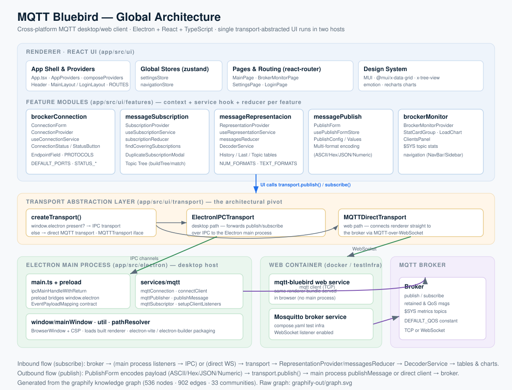

# MQTT Bluebird — Arquitectura global

> Generado a partir del grafo de conocimiento de **graphify** (536 nodos · 902 aristas · 33 comunidades) y verificado contra el código actual del repositorio.



*(El grafo crudo completo está en `graphify-out/graph.svg` y la versión interactiva en `graphify-out/graph.html`.)*

---

## 1. Visión general

**MQTT Bluebird** es un cliente MQTT multiplataforma de escritorio/web. La pieza clave de su diseño es que **una única UI React** se ejecuta en **dos hosts distintos** sin cambios, gracias a una **capa de abstracción de transporte** que decide en tiempo de ejecución cómo hablar con el broker:

- **Escritorio (Electron):** la UI se comunica por IPC con el proceso *main*, que mantiene el cliente MQTT real.
- **Web (Docker):** la misma UI se conecta directamente al broker por MQTT-sobre-WebSocket, sin proceso *main*.

Stack: **Electron + React + TypeScript**, MUI como sistema de diseño, `zustand` para estado global, `react-router` para rutas, `recharts` para gráficas y la librería `mqtt` como cliente. El monorepo se gestiona con **pnpm** y se construye con **electron-vite** / **electron-builder**.

---

## 2. Capas

### 2.1 Renderer · React UI (`app/src/ui`)

- **App shell & providers** — `App.tsx`, `AppProviders`, `composeProviders`, `Header`, layouts (`MainLayout` / `LoginLayout`) y `ROUTES`. Los providers se componen en árbol e inyectan settings, tema y contexto MQTT.
- **Stores globales (zustand)** — `settingsStore`, `navigationStore`.
- **Pages & routing** — `MainPage`, `BrokerMonitorPage`, `SettingsPage`, `LoginPage`.
- **Design system** — MUI (`@mui/material`, `@mui/x-data-grid`, `@mui/x-tree-view`), `emotion`, `recharts`.

#### Módulos de feature (`app/src/ui/features`)

Cada feature sigue el mismo patrón: **Context Provider + hook de servicio + reducer/store**.

| Feature | Responsabilidad | Piezas clave |
|---|---|---|
| `brockerConnection` | Formulario y estado de conexión al broker | `ConnectionForm`, `ConnectionProvider`, `useConnectionService`, `ConnectionStatus`/`StatusButton`, `EndpointField`, `PROTOCOLS`, `DEFAULT_PORTS` |
| `messageSubscription` | Suscripciones y árbol de topics | `SubscriptionProvider`, `useSubscriptionService`, `subscriptionReducer`, `findCoveringSubscriptions`, `DuplicateSubscriptionModal`, `buildTree`/`matchSegments` (wildcards MQTT) |
| `messageRepresentacion` | Recepción, decodificación y visualización de mensajes | `RepresentationProvider`, `useRepresentationService`, `messagesReducer`, `DecoderService`, tablas History/Last/Topic, `NUM_FORMATS`/`TEXT_FORMATS` |
| `messagePublish` | Composición y publicación de mensajes | `PublishForm`, `usePublishFormStore`, `PublishConfig`, codificación multi-formato (ASCII/Hex/JSON/Numeric) |
| `brockerMonitor` | Panel de métricas del broker | `BrockerMonitorProvider`, `StatCardGroup`, `LoadChart`, `ClientsPanel`, estadísticas vía topics `$SYS` |
| `navigation` | Barra de navegación y sidebar | `NavBar`, `useNavItems`, `useNavigationStore` |

### 2.2 Transport Abstraction Layer (`app/src/ui/transport`) — el pivote

```ts
export function createTransport(): MQTTTransport {
  if (typeof window !== 'undefined' && window.electron) {
    return createElectronIPCTransport();   // escritorio
  }
  return createMQTTDirectTransport();      // web
}
```

- **`MQTTTransport`** (`types/transport.types.ts`) es la interfaz común: `publish`, `subscribe`, listeners, `unsubscribe`.
- **`ElectronIPCTransport`** reenvía publish/subscribe por **IPC** al proceso main.
- **`MQTTDirectTransport`** abre un cliente MQTT **directo por WebSocket** desde el renderer.
- Ambas implementaciones son intercambiables (`graphify` las marca como *semantically similar* con confianza 0.95). La UI nunca sabe en qué host corre.

### 2.3 Electron main process (`app/src/electron`) — host de escritorio

- **`main.ts` + preload** — registra handlers IPC (`ipcMainHandleWithReturn`) para `mqttPublish` y `mqtt:connection`; el `preload` expone `window.electron` siguiendo el contrato `EventPayloadMapping`.
- **`services/mqtt`** — la lógica MQTT real:
  - `mqttConnection.ts` → `connectClient` / `destroyClient`
  - `mqttPublisher.ts` → `publishMessage`
  - `mqttSubscriptor.ts` → `setupClientListeners` (reenvía mensajes entrantes al renderer)
- **`window/mainWindow.ts`, `util`, `pathResolver`** — `BrowserWindow` con CSP, carga del bundle del renderer, resolución de rutas en dev/prod.

### 2.4 Web container (`docker` / `testInfra`)

- El **mismo bundle del renderer** se sirve en el navegador (sin proceso main).
- **Mosquitto** como broker con listener WebSocket habilitado (`compose.yaml`).

### 2.5 Broker MQTT

Broker (p. ej. Mosquitto) que gestiona publish/subscribe, mensajes retenidos y QoS, y expone métricas en topics `$SYS` consumidas por el monitor. `DEFAULT_QOS` es la constante por defecto.

---

## 3. Flujos extremo a extremo

### Publicación (outbound)
1. `PublishForm` codifica el payload según el formato elegido (ASCII / Hex / JSON / Numeric).
2. Llama a `transport.publish()`.
3. **Escritorio:** IPC → `publishMessage` (main) → cliente MQTT → broker.
   **Web:** cliente directo → broker.

### Suscripción / recepción (inbound)
1. El broker entrega un mensaje.
2. **Escritorio:** `setupClientListeners` (main) → IPC → transporte.
   **Web:** cliente WebSocket → transporte.
3. El transporte notifica a `RepresentationProvider` → `messagesReducer`.
4. `DecoderService` decodifica el payload y alimenta las tablas (History/Last/Topic) y las gráficas.

---

## 4. Módulos transversales y nodos centrales

Según el grafo, las **abstracciones más conectadas** (god nodes) son:

- `useRepresentationContext` — puente de mayor centralidad (betweenness 0.058): conecta representación de mensajes con páginas/rutas y el árbol de topics.
- `Subscription` — tipo central del estado de suscripciones (17 aristas).
- `useMQTTContext()` / `useConnectionContext` — acceso al contexto MQTT y de conexión.
- `DecoderService` — decodificación compartida por todas las vistas de tabla.
- `setupClientListeners` — puente entre el proceso main y la representación de mensajes.

**Hiperaristas (relaciones de grupo) destacadas:**
- *Interchangeable MQTT Transport Implementations* (0.95) — el patrón de transporte.
- *Connection context provider and consumers* — provider de conexión + sus consumidores.
- *Subscription state management flow* — servicio + reducer + tipos de suscripción.
- *Topic Tree Construction and MQTT Wildcard Matching* — `buildTree` + `matchSegments`.

---

## 5. Build & tooling

- **Monorepo pnpm** (`pnpm-workspace.yaml`): app de escritorio + scripts de publisher de prueba en Node.
- **electron-vite** para dev/build del renderer + main; **electron-builder** para empaquetar (config `appId`, `asar`, targets `linux`/`mac`).
- Configs TypeScript por contexto (app / node / root), ESLint (`ts-standard`, `typescript-eslint`), **Vitest** + `jsdom` para tests.
- `testInfra/compose.yaml`: Mosquitto + contenedor web para pruebas de integración.

---

## 6. Notas y oportunidades (del informe del grafo)

- Varias comunidades grandes tienen **baja cohesión** (`Message Representation & Decoding` 0.09, `Broker Connection Form` 0.11, `Electron Main & MQTT Service` 0.11) — candidatas a dividirse en módulos más enfocados.
- ~200 nodos aislados son en su mayoría **claves de configuración** (campos de `package.json`, `tsconfig`, electron-builder), no código huérfano.
- No se detectaron **ciclos de importación**.

---

*Para explorar: `graphify query "<pregunta>"`, `graphify explain "<nodo>"`, o abre `graphify-out/graph.html`. Informe completo en `graphify-out/GRAPH_REPORT.md`.*
